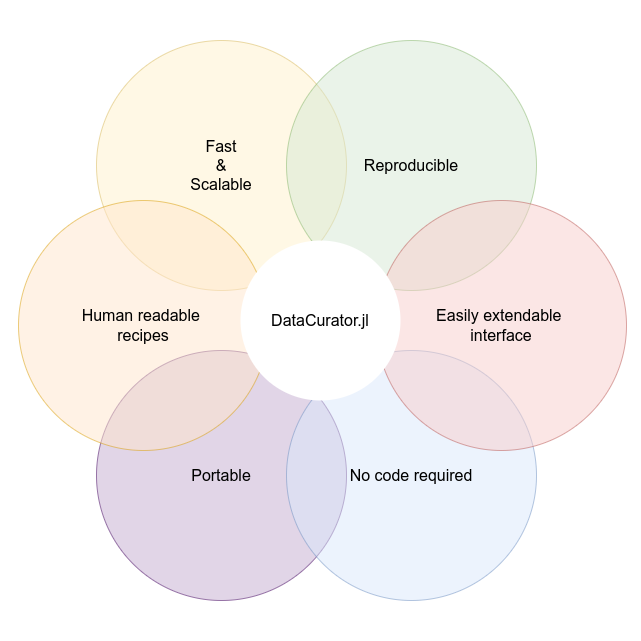

# DataCurator

A multithreaded package to validate, curate, and transform large heterogenous datasets using reproducible recipes, that can be created both in TOML human readable format, or in Julia.



DataCurator is a Swiss army knife that ensures:
- pipelines can focus on the algorithm/problem solving
- you have a human readable recipe for future reproducibility
- you can validate huge datasets at speed
- you need no code or dependencies to do it


## Quickstart
### Installation
#### As a local repository
You need:
- Julia
- git

```bash
git clone git@github.com:bencardoen/DataCurator.jl.git
cd DataCurator.jl
julia
julia>using Pkg; Pkg.activate("."); Pkg.instantiate()
```

#### As a Julia package
You need:
- Julia

```julia
using Pkg;
Pkg.add(url="https://github.com/bencardoen/DataCurator.jl")
using DataCurator
```
#### Download the executable image
You need:
- A command line environment (WSL on windows, any shell on Linux or MAC)

```bash
wget <URL TO DO>
```

#### Singularity
TODO download from sylabs + build


**Note**

If you run into issues with files or directories not found, this is because the Singularity container by default has no access except to your $HOME directory. Use
```
singularity run -B /scratch image.sif ...
```
where /scratch is a directory you want read/write access to.

## Running
### Using TOML recipes
Our package does not require you to write code, so as long as you understand what you want to happen to your data, and you can read and write a text file, that's all it takes.

For example, extract all .txt files from a deep filesystem into a single flat directory
```toml
[global]
act_on_success = true
inputdirectory = "your/very/deep/directory/structure"
[any]
all=true
conditions = ["isfile", ["endswith", ".txt"]]
actions = [["flatten_to", "your/flattened_path"]]
```
Assuming inputdirectory and "your/flattened_path" exist, you can just do
Then
```bash
./datacurator --recipe your.toml --verbose
```
or
```bash
julia --project=. src/curator.jl --recipe your.toml --verbose
```

Check example_recipes/documented_example.toml for all possible options in a single example.

## Manual
A more extensive manual is available at [manual.md](manual.md)

## Troubleshooting

#### Conditions not working as expected
- Check if you used regex syntax without setting regex=true
- Check the log to see if your conditions are being recognized
#### I'm getting weird non-deterministic results
- If you use parallel=true, and global variables, and no locks, then that is expected, use the lists to aggregate anything in a threadsafe way
#### Things are slower with parallel=true
- If you have small data on a fast filesystem, the gain of using threads is minimal, and so overhead begins to dominate. Use parallel=true if you have a lot of files, need to read/check large files, a slow filesystem, and/or deep hierarchies. By default, the nr of threads = JULIA_NUM_THREADS = nr of cores. So on a cluster, think if that makes sense for you. For small to medium datasets I'd be surprised if you gain from more than 16 threads. On the other hand, for large (>1TB, 1e6 files) datasets, 24+ has worked for me.
#### I told your code to quit, but it kept going
- With parallel=true, it can take time before all other threads get the message that they too should quit, not just the thread that's doing work. Without a locked global that is continuously checked, in which case performance drops extremely, there's no way to avoid this. If you need a brusque "drop everything" exit, then use a function like

    ```julia
    end_times = x -> exit(-1)
    ```
Don't expect counters, filelists etc to be in a usable state if you do this.
